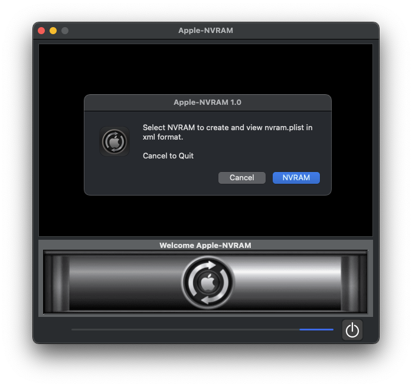
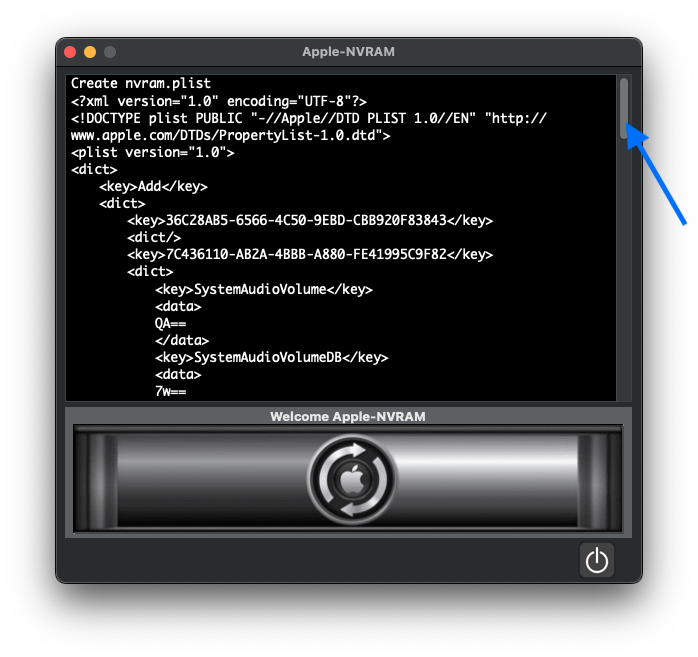
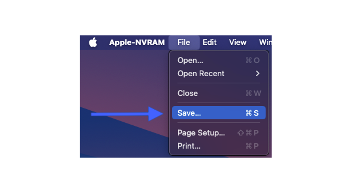
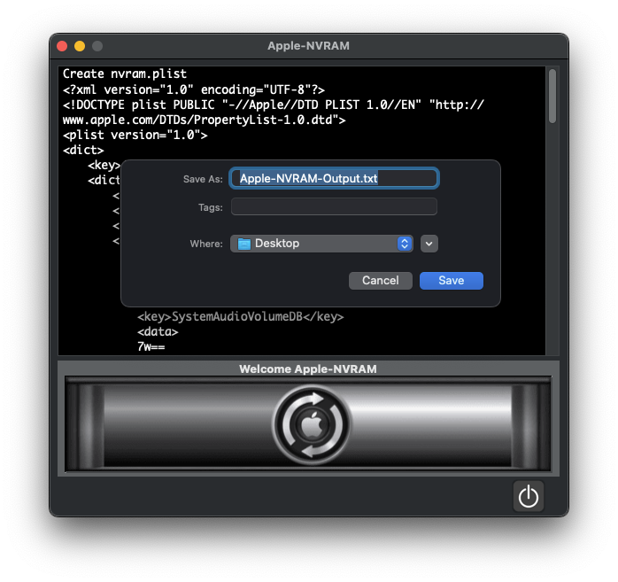

# Apple-NVRAM
- OpenCore (Hackintosh User)

#### Downloads ➤ [Apple-NVRAM](https://github.com/chris1111/Apple-NVRAM/raw/Master/Apple-NVRAM.zip)

<h4>Credit:</h4>
<ul>
    <li>Build by <a href="https://github.com/chr
                     is1111/">chris1111</a></li>
    <li>Acidanthera <a href="https://github.com/acidanthera/OpenCorePkg/tree/master/Utilities/LogoutHook">nvramdump</a></li>
    <li>PlistBuddy Tools <a href="https://www.unix.com/man-page/osx/8/PLISTBUDDY/">PlistBuddy</a></li>
</ul>

#### Script ➦ [Main Scipt](https://github.com/chris1111/Apple-NVRAM/blob/Master/Sources/Resources/script)

## ⇩ View Spoiler Usage:

 
  
Usage

